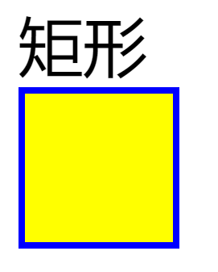
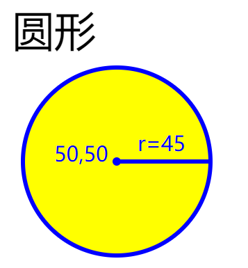
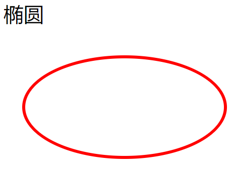
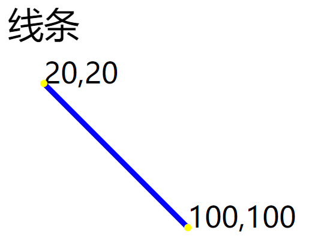
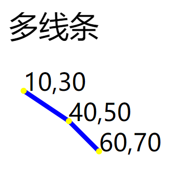
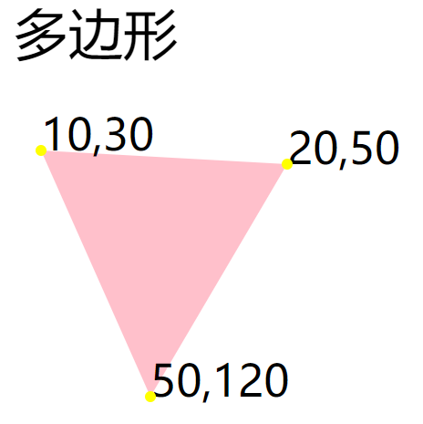
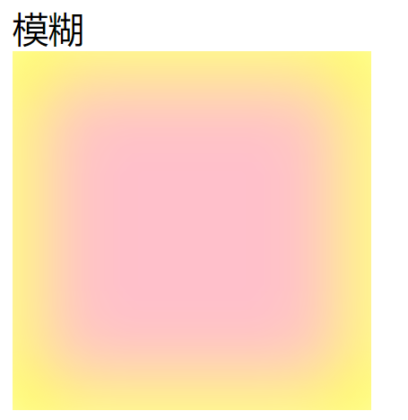
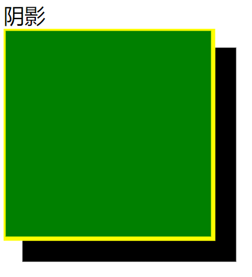
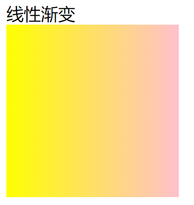

# svg学习

解决图标的最佳方案，平时我们添加图标的时候可能会对图标进行放大和缩小的处理，当图标被放大以后图标像素可能会失真，这样对用户视觉效果有一定的影响，那么怎么解决呢，于是就想到可以尝试用svg解决这个问题
Svg 是通过对图形进行绘制而形成的

## 使用方式
   ```<svg width='100' height='100'>...</svg>```创建一个100*100的画布```
### 一·绘制种类
  #### 绘制矩形-rect 
  ```
  <svg  width="110" height="110">
        <rect width='110' height='110' fill='yellow' stroke-width='4' stroke='blue'  />
    </svg> 
  ```
 	说明： 
      Width:宽度
      Height：高度
      fill：填充颜色
      stroke-width：边框宽度
      stroke：边框的颜色
      fill-opacity:填充透明度
      stroke-opacity：边框透明度
      可以写成opacity：0-1之间任意数
      Rx、ry：角度弧形的程度
  效果图：
   

  #### 绘制圆形-circle
  ```
  <svg width="200" height="200" fill='blue'>
    <circle cx='50' cy='50' r='45' fill='yellow' stroke-width='4' stroke='blue'/>
  </svg>
  ```
	说明:
      cy、cy：圆形的x、y的坐标
      R：圆形的半径
    效果图：
   

  #### 绘制椭圆-ellipse
```
    <svg width="500" height="150">
        <ellipse cx="120" cy="80" rx="100" ry="50" fill="none" stroke="red" stroke-width="3"></ellipse>
    </svg>
```
  说明:
      cx、cy：椭圆的x、y的坐标
      rx、ry：水平、垂直半径
    效果图：
   

  #### 绘制线条-line

  ```
  <svg width="200" height="200" >
    <line x1='10' y1='10'  x2='100' y2='100'  stroke="blue" stroke-width="3"/>
  </svg>
  ```

  说明:
      x1、y1：起点坐标
      x2、y2：终点坐标
  效果图：
   

  #### 绘制多线条-polyline
  ```
  <polyline points="10,30 40,50 60,70" fill="none" stroke="blue" stroke-width="3" />
  ```
  说明:
      points：三个点的坐标 以空格分开
  效果图：
   

  #### 绘制多边形-polygon
  ```
  <polygon points="10,30 100,35 50,120" fill="pink" />
  ```
  说明:
      points：多个点的坐标 以空格分开
  效果图：
   

  #### 绘制文本-text

   ```
   <text x='20' y='50' transform='rotate(10,20,30)' font-size='20' text-anchor='start/middle/end'> 11111111</text>
   ```
  说明:
      x、y:文本的起点位置
      transform：旋转角度(r x,y)r-旋转角度 x,y旋转中心点 x,y默认为0,0
      font-size:字体大小
      text-anchor：文本对其方式
      text增加跳转地址：用

    ```
    <svg   width="200" height="200" xmlns:xlink='http://www.w3.org/1999/xlink'>
        <a xlink:href='' target='_blank'>
            <text x='20' y='50' transform='rotate(10,20,30)' font-size='20' text-anchor='start/middle/end'> 跳转</text>
        </a>
    </svg>
    ```
  #### 绘制路径-path
  ```
  <svg width="200" height="200">
    <path d='M30 150 q70 -200 150 0'  fill="none" stroke-width='2' stroke='orange' />
  </svg>
  ```
  说明:
      d(draw):
      M(Moveto):M-决定定位 m-相对定位
      L(lineto):
      q：控制点(x,y) 终点(x,y)
      stroke-width：边框宽度
      stroke：边框的颜色
      stroke-linecap：笔画笔帽属性 -butt 灭有线帽 -round圆形线帽 square 方形
      stroke-dasharray：虚线笔画数性 至少两个数字
    当多个路径或者图形组合在一起。并且拥有相同颜色或者线条宽度时，为了减少多次在标签中设置相同的配置，可以将拥有相同配置的标签以<g>包裹住，在<g>标签上加入属性，如<g fill='red'>
  效果图：
   

  #### 模糊效果和阴影效果
  模糊效果:
    ```
      <svg width="200" height="200">
        <defs>
            <filter x="0" y="0" id='f1'>
                <feGaussianBlur stdDeviation='20' />
            </filter>
        </defs>
        <rect width='200' height='200' fill='pink' stroke='green' stroke-width='30' filter='url(#f1)'></rect>
    </svg>
    ```
  效果图：
   

    阴影：
      ```
         <svg width="300" height="300">
        <defs>
            <filter x="0" y="0" width="100" height="100" id="f2">
                <feOffset in="SourceAlpha" dx="20" dy="20" />
                <feBlend in="SourceGraphic" />
            </filter>
        </defs>
        <rect width='200' height='200' fill='green' stroke='yellow' stroke-width='4' filter="url(#f2)"></rect>
    </svg>
      ```
注意：filter="url(#f2)"要与id="f2"内容是一样的
  效果图：
   

  #### 线性渐变-linearGradient
    <svg width="200" height="200">
        <defs>
            <linearGradient x1="0%" y1="0%" x2="100%" y2="0%" id="f6">
                <stop offset="0%" stop-color="yellow" />
                <stop offset="100%" stop-color="pink" />
            </linearGradient>
        </defs>
        <rect width='200' height='200' fill="url(#f6)" />
    </svg>
说明: 
  offset:开始和结束位置的属性值
  stop-color：渐变的颜色 
   需要注意的是id要与下面的url里面的内容一致
  效果图：
   

  #### 径向渐变-radialGradient
```
    <svg width="400" height="400">
        <defs>
            <radialGradient id="f4" cx="50%" cy="50%" r="50%" fx="50%" fy="50%">
                <stop offset="0%" stop-color="yellow" />
                <stop offset="100%" stop-color="pink" />
            </radialGradient>
        </defs>
        <rect width='200' height='200' cx="200" cy="30" r="50" fx="40" fy="50" fill="url(#f4)"></rect>
    </svg>
```
说明:
 offset:开始和结束位置的属性值
 stop-color：渐变的颜色 
 cx,cy,r:外面的圆和半径
 fx,fy:内部的为止
 效果图：
 

