 
作为一个it打工人，怎么没有一个属于自己的的博客呢，于是我在网上各种搜索，查询各种教程，最后终于创建了一个自己的博客，创建完成之后，就迫不及待地创建了我的第一篇博客文章---"如何通过HEXO+github 创建属于自己的博客"
我用到的依赖包：
    ```
    "hexo-deployer-git": "^4.0.0",
     nvm("node":"16.14.1",npm)
     ```

由于我有git账号，注册账号的过程忽略，这里就不说了。

## 一、安装hexo

<span style="font-size:16px">**1、**</span> 在自己经常存代码的文件夹中，在顶部搜索栏中输入cmd，打开终端,如图：
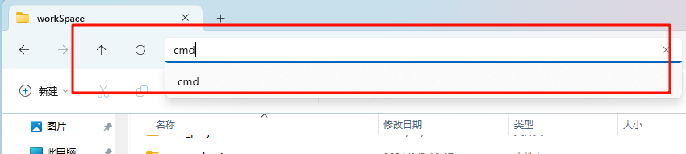

<span style="font-size:16px">**2、**</span> 安装hexo，如图
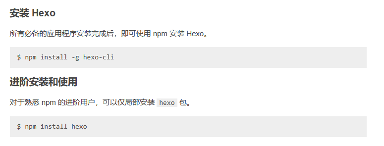

可以全局安装
``` 
npm install -g hexo-cli

```
也可以局部安装
```
npm install hexo
```

<span style="font-size:16px">**3、**</span> 运行hexo init xxx(项目名称)，如图
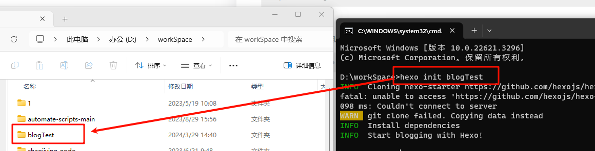
进入创建的文件夹，按照步骤1进入cmd中，输入``` npm install```
然后输入```hexo s```
 此时一个简单的hexo就完成啦！如图：
 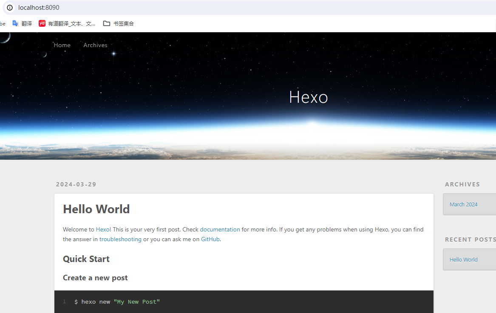

 ## 二、更换主题
<span style="font-size:16px">**1、**</span> 打开[hexo官方文档](https://hexo.io/zh-cn/docs/)
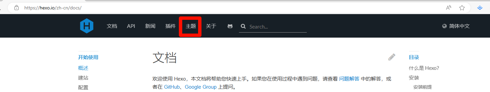
选择一个自己喜欢的主题，将git地址克隆下来
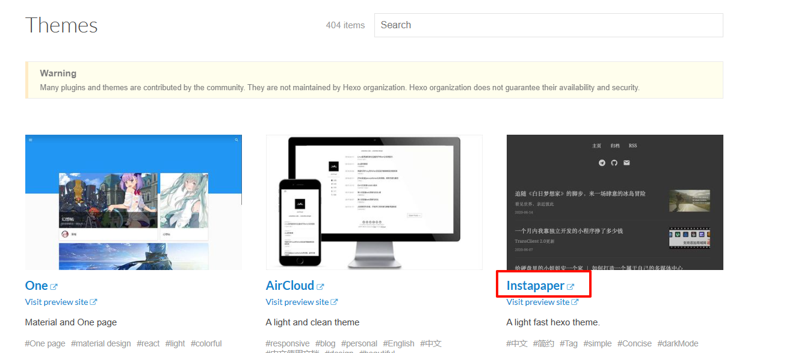
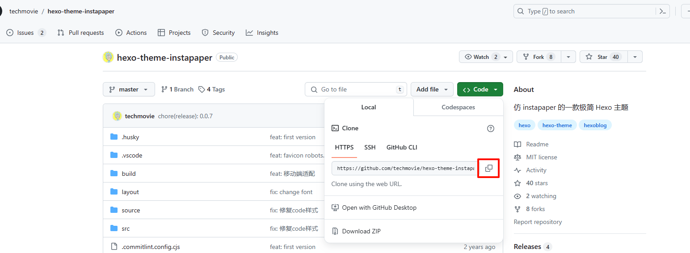
打开根目录下的themes，将git地址下载到themes内，

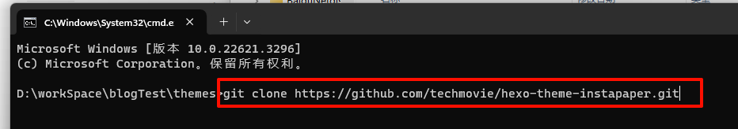
此时下载下来的文件名字可能是hexo-theme-xxxx,为了方便调用，将文件夹名字改为xxxx,然后打开根目录下的_config.yml文件，将theme后面的名称修改为刚刚文件夹的名字,如图
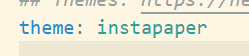
<span style="font-size:16px">**2、**</span> 打开终端Ctrl+c退出项目运行，输入```hexo clean```,此命令是清理缓存(删除db.json),然后在输入```hexo generate或者hexo g ```此命令是生成静态文件，最后输入```hexo server或者hexo s``` 启动服务器,默认的端口为4000，如果出现端口被占用，如图所示，
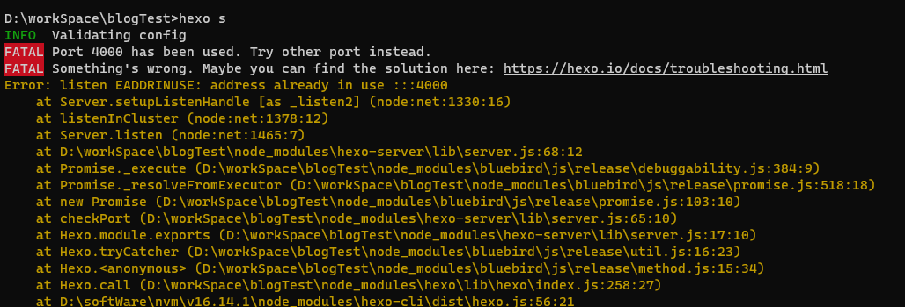
那么可以输入```hexp s -p 5555(端口号，可以随意拜变换)````,打开对应的地址，查看界面是否有变化

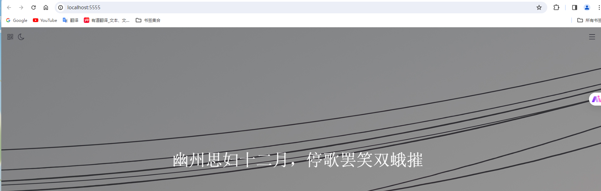
哇哈哈哈~~~~~~成功啦
## 三、关联git
说明：安装好git后，要配置SSH，并且要与git创建联系
<!-- ```js 
$ git config --global user.name "git用户名"
$ git config --global user.email "邮箱地址"
``` -->

<span style="font-size:16px">**1、**</span> 登录git，创建新项目，如图
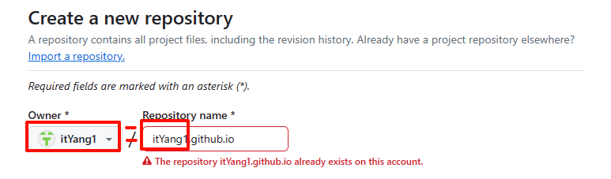
这里一定要<span style="color: #ff0000;font-size:30px">注意</span>创建的项目名字一定要以xxx.github.io这种格式命名，并且xxx要与owner的名字一样，不然最后界面显示不出来，项目名字创建完成后，进入如图页面
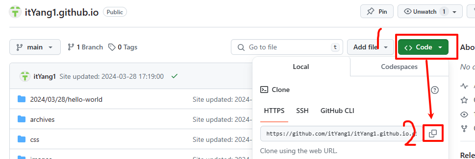复制git地址，打开项目更目录下的_config.yml文件 滚动到最底下，写入类似这种，如图：
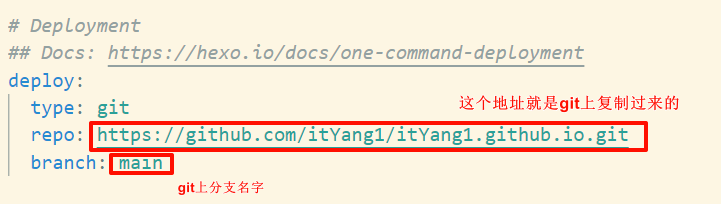
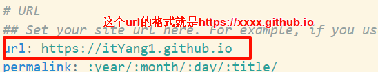
<span style="font-size:16px">**2、**</span> 打开终端Ctrl+c退出项目运行，输入```hexo clean```,此命令是清理缓存(删除db.json),然后在输入```hexo generate或者hexo g ```此命令是生成静态文件，最后输入```hexo server或者hexo s``` 启动服务器。

最后的效果
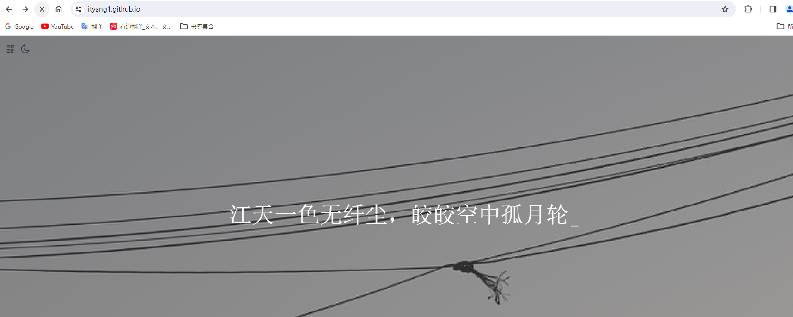


   


